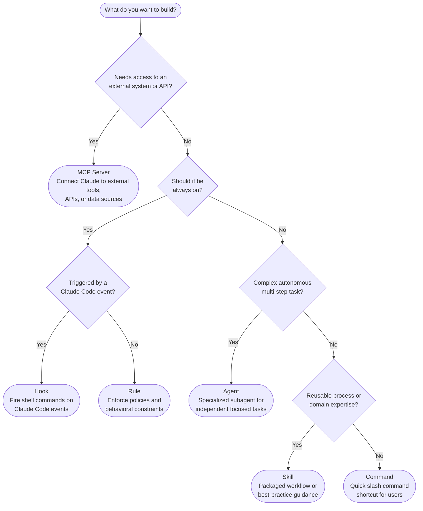

# plugin-builder

Tools for building Claude marketplace plugins.

## What Should I Build?

Not sure? Use the `choose-primitive` skill — it will ask you a few questions and guide you to the right answer.

## Skills

### `choose-primitive`

Guides you to the right Claude primitive for what you want to build. Asks a few questions about your goal and recommends between: skill, command, rule, hook, agent, or MCP server.

**Use when:** You know you want to build something but aren't sure which primitive fits.
