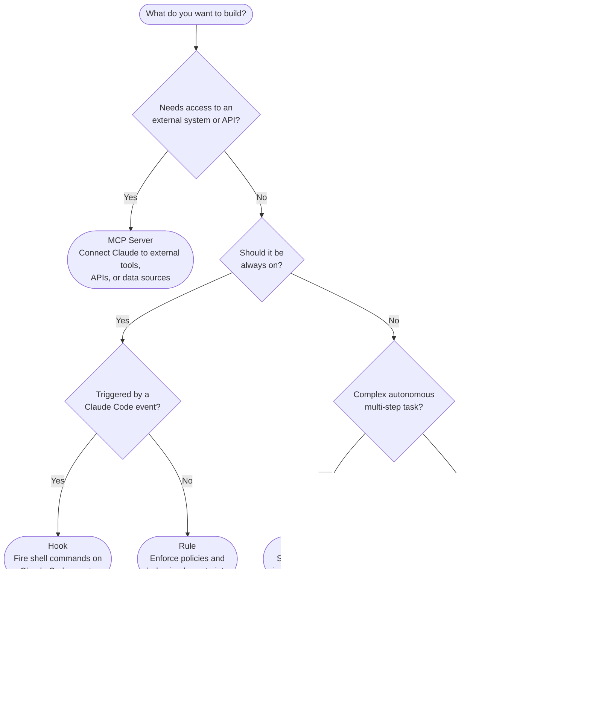

# plugin-builder

Tools for building Claude marketplace plugins.

## What Should I Build?


```mermaid
flowchart TD
    Start([What do you want to build?]) --> External

    External{Needs access to an\nexternal system or API?}
    External -- Yes --> MCP([MCP Server\nConnect Claude to external tools,\nAPIs, or data sources])
    External -- No --> AlwaysOn

    AlwaysOn{Should it be\nalways on?}
    AlwaysOn -- Yes --> Event
    AlwaysOn -- No --> Autonomous

    Event{Triggered by a\nClaude Code event?}
    Event -- Yes --> Hook([Hook\nFire shell commands on\nClaude Code events])
    Event -- No --> Rule([Rule\nEnforce policies and\nbehavioral constraints])

    Autonomous{Complex autonomous\nmulti-step task?}
    Autonomous -- Yes --> Agent([Agent\nSpecialized subagent for\nindependent focused tasks])
    Autonomous -- No --> Reusable

    Reusable{Reusable process or\ndomain expertise?}
    Reusable -- Yes --> Skill([Skill\nPackaged workflow or\nbest-practice guidance])
    Reusable -- No --> Command([Command\nQuick slash command\nshortcut for users])
```

Not sure? Use the `choose-primitive` skill — it will ask you a few questions and guide you to the right answer.

## Skills

### `choose-primitive`

Guides you to the right Claude primitive for what you want to build. Asks a few questions about your goal and recommends between: skill, command, rule, hook, agent, or MCP server.

**Use when:** You know you want to build something but aren't sure which primitive fits.

### `scaffold-plugin`

Creates a complete plugin scaffold — directory structure, `plugin.json`, `README.md`, primitive subdirectories, and registers the plugin in `marketplace.json`. Commits the result.

**Use when:** You're ready to start a new plugin and want the boilerplate wired up correctly from the start.

## Scripts

### `scripts/namecheck.py`

Checks candidate plugin names against npm, PyPI, crates.io, GitHub repo names,
and DNS for `.com`/`.ai`, and prints a verdict per name.

```bash
export GITHUB_TOKEN=$(gh auth token)   # optional; raises the GitHub search rate limit
python3 scripts/namecheck.py cairn meldwerkes plangent
```

**Use when:** naming a new plugin, before you get attached to one.

Uniqueness is a filtering outcome, not a generation outcome — so generate a
wide list of candidates and let this decide. Two findings from checking ~40
names are worth knowing going in:

- **Every dictionary word is taken**, no matter how obscure. `midden`,
  `heddle`, `adversaria`, `colophon`, and `hypomnema` are all registered on
  both npm and PyPI.
- **Short pronounceable coinages are worse**, because they are exactly what
  brandable-name generators emit.
- **Two-morpheme compounds are wide open.** Every `-werk(s)` candidate tested
  came back with zero GitHub repos and every registry and domain free.

So reach for a compound, not a rarer word.

### `scripts/hookcheck.py`

Smoke-tests a plugin's hooks against *ordinary* input — a slash command, plain
prose, a routine tool call — and fails if any of them exits 2, times out, or
returns a blocking decision.

```bash
python3 scripts/hookcheck.py ../my-plugin
```

**Use when:** any time a plugin declares hooks, and always before shipping one.

Hooks are the only plugin primitive that can break a session outright, and the
failure looks to the user like Claude Code is broken rather than like a plugin
bug. The check that matters is not whether a hook works on the case it was
written for, but whether it stays out of the way on the cases it was not.

It also flags `type: "prompt"` hooks on non-`Stop` events. Prompt hooks are
**gates**: the evaluating model returns ok:true/false, and a false carries
`preventContinuation`. Anything passive — logging, capture, context injection —
must be `type: "command"`.

This exists because a `UserPromptSubmit` prompt hook once shipped that answered
`NO_SIGNAL` for any unremarkable message, which blocked every ordinary prompt
including the plugin's own setup command. One run against a plain prompt would
have caught it.
